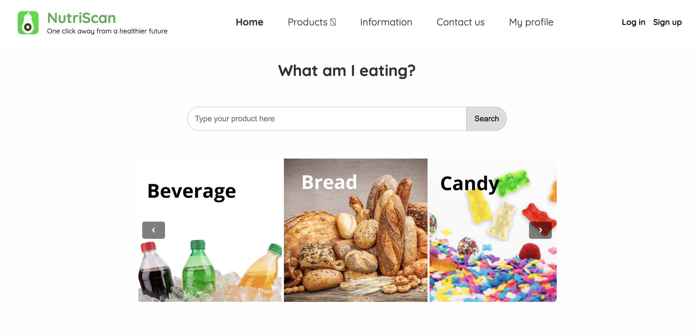
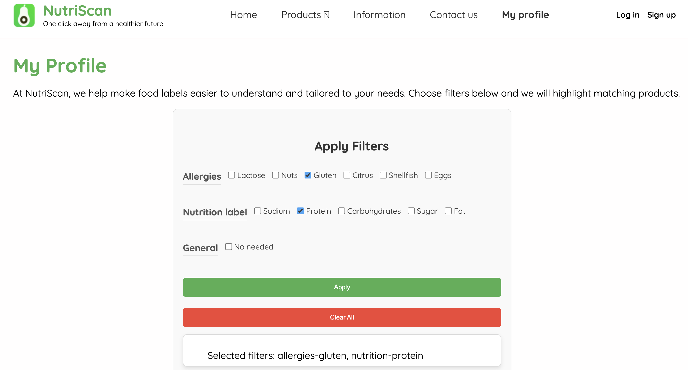
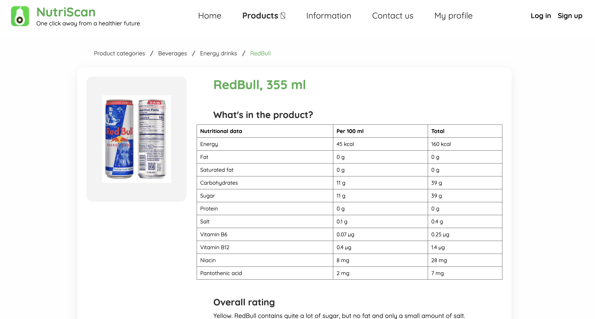
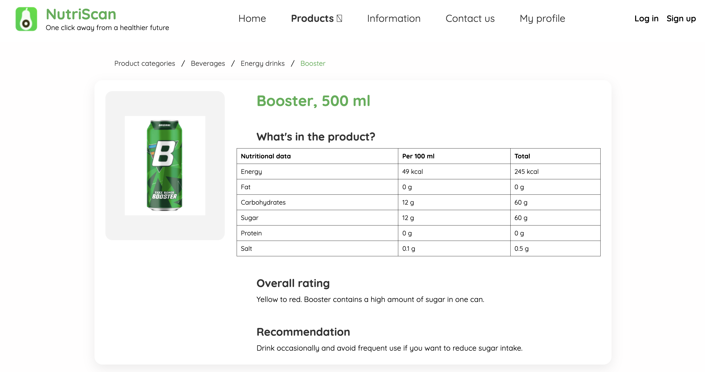

# NutriScan - Nutrition Understanding Prototype

A frontend web prototype exploring how nutritional information can be communicated in a clearer, more accessible and user-friendly way.

---

## Demo

<p align="center"> 
   
</p>

<p align="center">
  <a href="https://github.com/ceciliestadekristensen/nutriscan-web-application/raw/main/demo/nutriscan.mp4">
    ▶ Watch full demo video
  </a>
</p>

---

## Overview

NutriScan was developed as a university project focused on improving how users understand nutritional information through interface design, visual hierarchy and structured content presentation.

The project explores how a web-based solution can support users in making faster and more informed decisions when navigating nutrition labels and product information.

Although the project is a prototype, it demonstrates how user research, interface design and frontend implementation can be combined into a coherent digital solution.

---

## Problem Statement

> How can a web solution assist consumers in understanding and navigating within the scientific language of nutritional labels, while offering personal preferences and restrictions that align with dietary needs?

---

## Project Scope

The prototype includes:

- A homepage with a visual carousel  
- A general product overview page  
- Individual product pages (Red Bull, Booster, Monster)
- Search functionality for predefined products 
- UI elements for filtering, search, and user profiles  

The project was developed as a prototype and therefore has some limitations:

- Product data is hardcoded
- Filtering is visual only
- No backend or live database is connected
- Search only works across predefined content

---

## My Contribution

In this project, I worked primarily with frontend structure, interface design and implementation.

My contribution included:

### Frontend Development
- Building page structure in HTML, CSS and JavaScript
- Developing the homepage layout and navigation flow
- Implementing search functionality for predefined products

### UI and Interaction Design
- Designing consistent page layouts
- Creating a clearer visual hierarchy for nutritional information
- Supporting usability through navigation and interface decisions

### Research Translation
- Contributing to the translation of user research into interface decisions
- Working with a design approach informed by questionnaire data, interviews and computational thinking

---

## Design and Research Foundation

The project was based on both quantitative and qualitative research, including:

- Questionnaire responses from 63 participants
- User interviews
- Iterative design reflections

Key findings included:

- Users struggle with complex terminology
- Users want quick and clear information
- Visual indicators like colors improve understanding

---

## Key Features

- Product browsing structure
- Search for selected products
- Structured nutritional information pages
- Filtering interface concept
- Login and signup simulation using localStorage
- Profile page layout

---

## Technologies

- HTML5
- CSS3
- JavaScript
- LocalStorage

---

## Screenshots

### Interface & Features

<table align="center">
  <tr>
    <td align="center">
      <br>
      <sub><b>Homepage</b></sub>
    </td>
    <td align="center">
      <br>
      <sub><b>Filtering Concept</b></sub>
    </td>
  </tr>
  <tr>
    <td align="center">
      <br>
      <sub><b>Product Page</b></sub>
    </td>
    <td align="center">
      <br>
      <sub><b>Nutritional Layout</b></sub>
    </td>
  </tr>
</table>

---

## Report

This project was developed as part of a university course.

**Full report:**
[Download NutriScan Report](https://github.com/ceciliestadekristensen/nutriscan-web-application/raw/main/report/nutriscan.pdf)

The report includes:
- User research and analysis
- Design process and iteration
- Implementation and system structure

---

## Learning Outcome

This project strengthened my experience in:

- Frontend development
- User-centered interface design
- Structuring information for usability
- Translating research into digital design decisions

---

## Purpose

The purpose of NutriScan was to explore how design and frontend development can support better understanding of nutritional information through a more intuitive and accessible web experience.

---

## How to Run

```bash
git clone https://github.com/your-username/nutriscan.git
````

Open in VS Code and run with Live Server.

---
